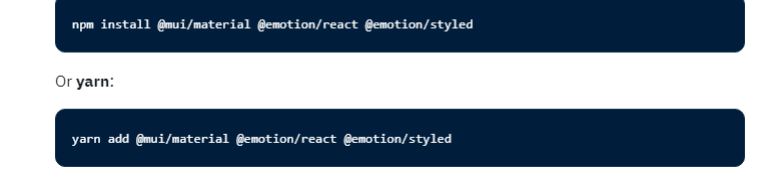
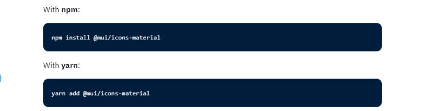
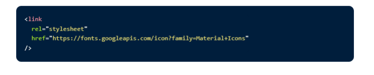

# Material UI
## Move faster with intuitive 
## React UI tools
## MUI offers a comprehensive 
## suite of UI tools to help you 
## ship new features faster. Start 
## with Material UI, our fullyloaded component library, or 
## bring your own design system 
## to our production-ready 
## components.

# What is material UI ?
## Material-UI is simply a library that allows us to import and use different 
## components to create a user interface in our React applications. This 
## saves a significant amount of time since the developers do not need to 
## write everything from scratch

### No, you cannot use Material-UI without React. Material-UI 
### is a library of React components

# Installation
## Install Material UI, the world's most popular React UI framework.
## Material UI is available as an npm package

# SVG icon
## In order to use prebuilt SVG Material icons, such as those found in the icons 
## demos you must first install the @mui/icons-material package

# Font icons
Material UI was designed with the Roboto font in mind. So be sure to follow these 
instructions. For instance, via Google Web Fonts:
Font icons
To use the font Icon component, you must first add the Material Icons font. Here are some 
instructions on how to do so. For instance, via Google Web Fonts:
